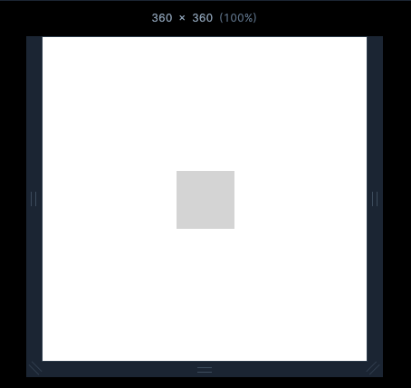
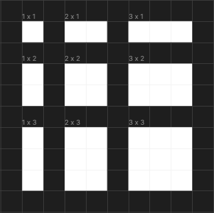

# 디자인을 바라보는 개발자의 시선 with Figma

김성백


---

## 디자인과 개발은 요소를 배치하는 관점이 약간 다릅니다.

- 디자인은 **절대 좌표**를 기준으로 이동시키면서 컨테이너에 요소를 얹는 방식
- 개발은 요소 간의 **상대 좌표**와 **관계**를 기준으로 컨테이너 내에 요소가 포함되는 방식
- 아직은 잘 이해가 안되시죠? 차근차근 설명해 드리겠습니다 🫡

---

## 절대 좌표

- 프레임
  - 디바이스(또는 브라우저)

- **relative**
  - 절대 좌표의 기준이 된다.


<!-- 먼저 피그마의 프레임을 디바이스 혹은 브라우저라고 생각해주세요. -->
<!-- 그리고 우측 패널에 있는 CSS 속성 중 position: relative가 적용되면 해당 요소가 절대 좌표의 기준점이 된다고 생각해주시면 됩니다.  -->

---


- **absolute**
  - 기준으로 삼은 요소에 대해 특정 거리만큼 띄운다. 

- 프레임(relative)을 기준으로 사각형을 위에서 148px, 왼쪽으로 148px 만큼 떨어져 있음을 의미.

<!-- 여기서는 프레임 내부의 사각형에 CSS 속성 position: absolute가 적용되어 있는 것을 보실 수 있을 거에요. -->
<!-- 따라서 간단하게 말하면 프레임의 (0, 0)을 기준으로 사각형을 위에서 148 왼쪽으로 148만큼 띄운다라고 이해해주시면 됩니다.  -->

---

## 알려준 대로 개발해보기!

> 이해를 돕기 위한 가상의 코드입니다.

```html
<Frame 
  css={
    position: relative;
    width: 360px;
    height: 360px;
  }
>
  <Rectangle 
    css={
      position: absolute;
      width: 64px;
      height: 64px;
      left: 148px;
      top: 148px;
    }
  >
</Frame>
```



<!-- 그렇다면 우선 피그마가 알려준대로 개발해볼게요. -->
<!-- 여기서는 이해를 돕기 위해 리액트 코드와 비슷한 가상의 코드를 가져왔습니다.  -->
<!-- 먼저 프레임에 position: relative를 설정하여 절대 좌표의 기준으로 삼았고 -->
<!-- 프레임 내부의 사각형에 position: absolute를 설정해서 기준점으로부터 얼마만큼 떨어져 있는지 정의하게 됩니다.  -->

---

개발 별거 없네 ... ? 

## 피그마가 알려주는 대로만 하면 되잖아! 😄

---

🤖: 피그마 그대로 만들었습니다.

🧚‍♀️: 어...? 화면이 변화해도 가운데에 위치시켜주세요! (~~딱 보면 알아서 했어야지...~~)

🤖: 수정할게요! (~~피그마에 표현을 해놨어야지 ...~~)


---

디자이너 입장에서는 본인의 의도가 반영되지 않았고

개발자는 추가로 작업을 하게 되었어요 ...

## 그렇다면 왜 이런 일이 일어나는 걸까?

---

## 개발에서는 절대 좌표를 지양하기 때문!


> 앞서 본 것처럼 절대 좌표를 사용할 수도 있긴 합니다만
> 기본적으로는 부모 또는 형제와의 관계를 기준으로 요소를 배치합니다.

---

## 개발에서는 절대 좌표를 지양하기 때문!

### 성능 관점
- 위치를 계산하기 위한 추가적인 연산이 필요

---

## 개발에서는 절대 좌표를 지양하기 때문!

### 성능 관점
- 위치를 계산하기 위한 추가적인 연산이 필요

### 작업 효율 관점

- $x \times y$ 개만큼의 디자인이 필요

---

## 개발에서는 절대 좌표를 지양하기 때문!

> 1. 위치를 계산하기 위한 추가적인 연산이 필요 (성능)
> 2. $x \times y$ 개만큼의 디자인이 필요 (효율)

성능에 관한 문제는 개발자들의 숙제...😂로 남겨두도록 하고

우선은 작업 효율 측면에 대해서만 바라보도록 하죠!

---

## 브라우저(기기)의 화면 크기는 변할 수 있습니다.


---

## 브라우저(기기)의 화면 크기는 변할 수 있습니다.

**절대 좌표를 기준**으로 $x \times y$ 크기의 화면을 대응해야 한다면 

**절대 좌표를 기준**으로 디자인된 $x \times y$개의 프레임이 필요하게 됩니다.

#### ~~우선 저는 개발도 못할 것 같아요 🫠~~ 



---

## 좌표보단 흐름과 정렬로 표현

- 변화할 수 있는 모든 크기에 대해 절대 좌표로 모두 대응하는 것은 너무나 **비효율적!**

- 프레임의 크기가 변할 때마다 요소가 알아서 자리를 찾아가도록 구현!

### 어떻게? 흐름과 정렬을 이용해서!

- 좌표 대신 흐름과 정렬을 이용해서 표현하게 되면 화면이 늘어났을 때 **의도대로 화면이 변하게끔 유도**합니다.

- 즉, 변화할 수 있는 모든 화면에 **대응**하는 방법을 알려주는 것!

- 물고기(좌표)를 잡아주지 말고, 물고기(좌표)를 잡는 방법을 알려주자

---

## 흐름

일반적으로 요소들은 부모(프레임) 내부에서 가로 방향으로 배치되거나 세로 방향으로 배치됩니다.

```css
.frame {
  display: flex;
  flex-direction: {row | column}
}
```


---

## 정렬

부모(프레임) 내부에서 요소들이 어느 위치에 배치될  것인지를 설정

- TOP-LEFT
- TOP-CENTER
- TOP-RIGHT
- CENTER
- ...etc


---

이미 너무 많은 힌트를 드린 것 같지만 

결국 제가 말하고자 하는 핵심은 

디자인과 개발의 간극을 메울 수 있는

## **오토 레이아웃을 적극 활용하자!** 입니다.

---

## 왜 오토 레이아웃을 사용해야 하죠?

### 디자인과 개발이 동일한 관점으로 디자인을 바라볼 수 있게 됨. 

---

## 왜 오토 레이아웃을 사용해야 하죠?

- 디자인과 개발이 동일한 관점으로 디자인을 바라볼 수 있게 됨. 
### 디자인 입장에서는 오해의 소지 없이 본인의 의도를 분명히 전달할 수 있음.

---

## 왜 오토 레이아웃을 사용해야 하죠?

- 디자인과 개발이 동일한 관점으로 디자인을 바라볼 수 있게 됨. 
- 디자인 입장에서는 오해의 소지 없이 본인의 의도를 분명히 전달할 수 있음.

### 개발 입장에서도 디자인을 개발로 옮기기가 수월함.

---
## 왜 오토 레이아웃을 사용해야 하죠?

- 디자인과 개발이 동일한 관점으로 디자인을 바라볼 수 있게 됨. 
- 디자인 입장에서는 오해의 소지 없이 본인의 의도를 분명히 전달할 수 있음.
- 개발 입장에서도 디자인을 개발로 옮기기가 수월함.
### 알잘딱깔센? 🤔 잠시 넣어두고 **정확하게 요청하고 그대로 빠르게 구현**하자!

---

## 왜 오토 레이아웃을 사용해야 하죠?

- 디자인과 개발이 동일한 관점으로 디자인을 바라볼 수 있게 됨. 
- 디자인 입장에서는 오해의 소지 없이 본인의 의도를 분명히 전달할 수 있음.
- 개발 입장에서도 디자인을 개발로 옮기기가 수월함.
- 알잘딱깔센? 🤔 잠시 넣어두고 **정확하게 요청하고 그대로 빠르게 구현**하자!

### 결국 우리의 목표는 

- 개발자가 디자인을 해석하는데 드는 비용 ⬇️ 
- 디자이너의 의도를 반영하기 위해 드는 추가적인 커뮤니케이션 비용 ⬇

**이 두가지를 통해 빠르게 아이디어를 실현하는 것이니까요!**


---

# 그러면 개발자는 어떻게 디자인을 해석하나요?

---

## 개발자가 디자인을 해석하는 과정

프레임에 오토 레이아웃이 적용되어 있지 않더라도 오토 레이아웃이 적용되었다 생각합니다.

좌표보다는 흐름과 정렬을 기준으로 생각하기 때문이죠!

거기에 더해 패딩(padding)을 사용하기 위함이에요!


---

## 1. 패딩을 이용하는 방법

- 좌우 패딩을 설정


---

## 2. 정렬 모드를 이용하는 방법

- TOP-CENTER
- CENTER
- BOTTOM-CENTER


---

## 3. 영역만 차지하는 요소(Spacer)를 이용하는 방법

> 요소 간 간격(gap)이 일정하지 않은 경우에도 유용하게 사용 가능!


---


이외에도 다양한 구성 방법이 존재할 수 있지만

## 오토 레이아웃이 적용되어 있다는 것을 보장할 수 만 있다면

## 우선 디자인 ➡ 코드로의 변환이 쉽게 가능해집니다.


---

## 1. 패딩을 이용하는 방법

```html
<AutoLayout
  layout={horizontal}
  paddingLeft={20}
  paddingRight={20}
>
  <Circle>
</AutoLayout>
```


---

## 2. 정렬 모드를 이용하는 방법

```html
<AutoLayout
  layout={horizontal}
  align={CENTER}
  width={60}
>
  <Circle>
</AutoLayout>
```


---

## 3. 영역만 차지하는 요소(Spacer)를 이용하는 방법

```html
<AutoLayout
  layout={horizontal}
>
  <Spacer width={20} height={20}>
  <Circle>
  <Spacer width={20} height={20}>
</AutoLayout>
```


---

## 디자인 ➡ 코드로의 전환이 쉽다는 것은

# 왜냐구요? 


---


## 겉보기에는 똑같아 보일지 몰라도


---

## 개발자가 체감하기에는 어마어마한 차이가 있답니다 ..! 😃 


---

- 절대 좌표의 기준이 될 영역을 고민하지 않아도 되고!
- $11-4=7$과 같은 계산을 하지 않아도 되기 때문입니다 ...! 👍


---

추가로 어떤 형태로 구성이 되든 오토 레이아웃을 사용하여 디자인을 구성한다면

디자이너와 개발자가 동일한 방식으로 **디자인을 바라보고 있다는 것은 보장**할 수 있습니다!

디자인이 변경되더라도 대응하는 속도가 빨라지는 것은 당연하구요 👍


---

# 결론

## 디자인을 바라보는 개발자의 관점과 디자이너의 관점을 맞추자!


# TODO: 마무리 내용

- 당연하게도 정답은 없는 내용입니다만 디자이너 <-> 개발자 간에 충분히 고민해봄직한 주제라고 생각합니다.
- 저 역시도 피그마에 대해 알아본지 얼마 되지 않아 완벽하지는 않지만 서로의 영역에 대해 알아보고 이해하려 노력한 경험은 되게 값지다고 생각합니다.
- 다만 몰라서 안하기 보다는 정확히 알고 서로에게 요청을 하는 것이 더 좋은 문화라 생각해서 부끄럽지만 발표를 진행하게 되었습니다. 
- 시간 관계 상 압축하다 보니 너무 많은 내용을 담지는 못했지만 각각의 플랫폼에서 이러한 고민들을 함께 해보면 좋을 것 같네요!


---

# 끝!

감사합니다.
